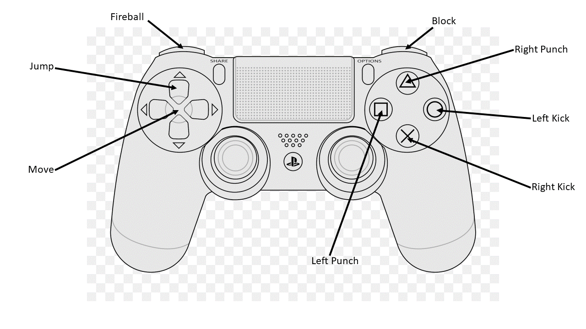

# LethalKombatPrototype
2.5D Fighting game

- Repo: https://github.com/ssecka/LethalKombatPrototype
- Video: https://www.youtube.com/watch?v=g2JY8QZeDH4
- Doku: https://docs.google.com/document/d/1Zig0xtx9IFOYtQlJjk0ZK496nqcRVO0-p5scnIO8aPk/edit?hl=de

## Gruppenmitglieder:
- Salif Secka 208959
- Telmo Santos Carneiro 208947
- Stefan Kurz 208904

## How to Start Playing
Die erste Instanz kann in Unity einfach durch Drücken von Play gestartet werden.
- Wenn Sie eine zweite Instanz auf Ihrem Computer starten möchten, können Sie dies ebenfalls tun.
    - Dazu müssen Sie das Projekt builden und die daraus resultierende .exe-Datei ausführen.

## Beschreibung
Bei Lethal Kombat handelt es sich um ein Player versus Player Fighter, indem 2 Spieler gegeneinander antreten. Lethal Kombat ist von der Street Fighter Series inspiriert. Es sind folgende Aktionen verfügbar:

- Movement (wsad)
- Jump (Space)
- Jab (Left mouse button)
- Hook (L)
- Sidekick (Right mouse Button)
- Fastkick (J)
- Haduken / Fireball (K)
- Block (SHIFT)

## Herausforderungen
- Die Umstellung von Local Multiplayer auf Online Multiplayer mit Fusion war der schwierigste Teil unseres Projekts, da die Dokumentation nicht sehr hilfreich war und wir sehr wenig Erfahrung mit Fusion hatten. Des Weiteren musst fast alle bereits vorhandene Scripts neu für Networking geschrieben werden.
- Es war schwierig, Server und Client zu synchronisieren.  
    - Anfangs wurde die UI nur beim Host aktualisiert.
    - Die Animationen und auch die VFX wurden nur beim Host abgespielt.
    - Die Animationen wurden nicht richtig gesynct

## Lessons Learned
- Eigene Animationen mit [Cascadeur](https://cascadeur.com/) erstellen
- Networking Synchronisierung

## Inspirationen
 - [Mortal Kombat](https://www.youtube.com/watch?v=0HEE78L_CnA)
 - [Street Figter](https://youtu.be/Tb521YYYkaE?si=BafHJbBSefCwxCjg&t=44)    

## Prefabs
- [HealthSystem](https://assetstore.unity.com/packages/tools/utilities/health-system-for-dummies-215755#description)

## Benutzte Dateien / Tutorials:

Assets/Scripts/Movment/NetworkCharacterControllerPrototypeCustom:
- basierend auf NetworkCharacterControllerPrototype von Fusion. Hierbei handelt es sich um das gerüst eines Character Controllers. Dieser wurde für unsere Anforderungen eingenständig stark abgeändert.

Assets/Scripts/Animations/Tick_Accurate/AnimatorStateSync.cs: 
- größtenteils aus dem Tutorial: https://doc.photonengine.com/fusion/current/technical-samples/animations#example-3---state-synchronization-with-animator | Example 3
übernommen

Assets/Scripts/Animations/Tick_Accurate/Player_AnimatorStateSync.cs: 
- stammt ebenfalls vom oben genannten Tutorial, wurde jedoch für unsere Projekt stark abgeändert.

https://www.youtube.com/watch?v=gxhG9BHcxmc&list=PLyDa4NP_nvPfHhPuumJylSj8jXyULsT1X&index=4
- Funktionsweise von Networked HP changes 

https://www.youtube.com/watch?v=Dn6pzf8scco&list=PLyDa4NP_nvPfHhPuumJylSj8jXyULsT1X&index=7
- Im Tutorial wird gezeigt wie eine Rackete für Fusion erzeugt wird im Bereich eines First Person Shooters. Wir haben die Idee dahinter auf den Fireball angewendet

Mixamo Animationen:
- Knockout
- Walking Animations
- Fireball

Sounds
- Hadouken Sound von Street Fighter
- Jab / Punch / SideKick / Kick von Diablo II

## Einzelne Netzwerkschritte:

### main

Dieser Branch ist der erste Versuch Lethal Kombat über das Internet gegeneinander spielen zu können. Da dieser Branch unter anderem keine State Authority berücksichtigt, haben wir sehr schnell einen desync zwischen Server und Client feststellen können. Dieser behinhalteten unter anderem:
- nicht registrierte Treffer
- nicht ausgeführte Animationen und somit Attacken
- Animationen wurde auf einer Seite abgebrochen und auf der Anderen nicht
- Unterschiedliche HP der einzelnen Spieler (z.B. Player 1 hat auf Host seite 600HP, auf Client seite aber noch 800 HP)

### NetworkRework

Für das Networking mussten wir alle bisherigen Scripte (aus main) neu schreiben, da sich die Logik ändert (z.B. müssen wichtige Änderungen in FixedUpdateNetwork aufgerufen werden).

Zuerst haben wir versucht die Animationen über das hochzählen eines Counter zu syncen. Dieser Counter war [Networked] was bewirkt, dass der Wert auf dem Client und dem Server gesynct wird und somit den gleichen Wert hat. Nach Recherche haben wir herausgefunden, dass diese Counter oft über einen generic Interpolator umgesetzt wird, wesshalb wir dies auf getestet haben. Da der Interpolator bessere Consitency hatte, haben wir uns für diesen entschieden.
Diese Probleme von dieser Implementierung wurde uns jedoch sehr schnell klar: Die Animationen waren nicht gut genug gesync. Bei anderen Arten von Spielen (z.B. FPS) wär dies kein größeres Problem, da jedoch unsere Attacken animation based getriggered werden, haben wir uns nach einer besseren alternativev umgesehen. Wichtig: Dieser Branch besitzt nicht alle Features, da wir mit dem besser Funktionierenden weitergearbeitet haben.

### NetworkAnimTick

Wir haben ein Beispiel von Fusion gefunden(https://doc.photonengine.com/fusion/current/technical-samples/animations#example-3---state-synchronization-with-animator), indem die mehrere Implementierungen aufgezeigt wurden, und wie stark der Delay von client-Server ist. Wir haben dann die "Animaton-State-Sync" dann in diesem Branch implementiert, indem wir die Datej "AnimationStateSync" kopiert haben und Player_AnimatorStateSync von dem Beispiel übernommen und für unsere Animationen angepasst haben. Der Nachteil von dieser Herangehensweise ist, dass es mehr Traffic erzeugt (was bei 2 Objekten jedoch vernachlässigbar ist). Der Vorteil ist, dass der Delay einer Animation von Client-Server nur noch teilweise wahrnehmbar ist, falls man Client und Server nebeneinander öffnet und die Animations vergleicht. 

### feature/ReplayButton

Aufgrund von Merge Conflicts haben wir einen neuen Branch erstellt um mögliche Bug durch einen manuellen Merge zu vermeiden.
